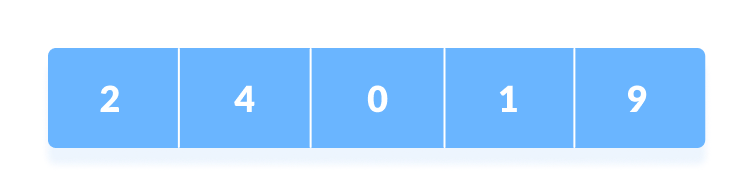

# Searching and Traversals

## Searching

Searching Algorithms are designed to check for an element or retrieve an element from any data structure where it is stored.

Based on the type of search operation, these algorithms are generally classified into two categories:

1. **Sequential Search**: In this, the list or array is traversed sequentially and every element is checked. For example: Linear Search.
2. **Interval Search**: These algorithms are specifically designed for searching in sorted data-structures. These type of searching algorithms are much more efficient than Linear Search as they repeatedly target the center of the search structure and divide the search space in half. For Example: Binary Search.

### Linear Search

Linear search is a sequential searching algorithm where we start from one end and check every element of the list until the desired element is found. It is the simplest searching algorithm It is widely used to search an element from the unordered list, i.e., the list in which items are not sorted. The worst-case time complexity of linear search is **O(n)**.

#### How Linear Search Works?

The following steps are followed to search for an element `k = 1` in the list below.



1. Start from the first element, compare `k` with each element `x`.

   

2. If `x == k`, return the index.

   

3. Else, return `not found`.

#### Linear Search complexity

- Time Complexity

  |   **Case**   | **Time Complexity** |
  | :----------: | :-----------------: |
  |  Best Case   |        O(1)         |
  | Average Case |        O(n)         |
  |  Worst Case  |        O(n)         |

- Space Complexity

  | Space Complexity | O(1) |
  | ---------------- | ---- |

#### Linear Search Algorithm

```plainetext
LinearSearch(array, key)
  for each item in the array
    if item == value
      return its index
```

### Binary Search

Binary Search is a searching algorithm for finding an element's position in a sorted array. In this approach, the element is always searched in the middle of a portion of an array.

#### Binary Search Working

Binary Search Algorithm can be implemented in two ways which are discussed below.

- Iterative Method
- Recursive Method

The recursive method follows the divide and conquer approach.

The general steps for both methods are discussed below.

1. The array in which searching is to be performed is:
   
   Let `x = 4` be the element to be searched.
   </br>

2. Set two pointers low and high at the lowest and the highest positions respectively.
   
   </br>

3. Find the middle element `mid` of the array ie. `arr[(low + high)/2] = 6`.
   
   </br>

4. If `x == mid`, then return mid.Else, compare the element to be searched with `m`.
   </br>

5. If `x > mid`, compare x with the middle element of the elements on the right side of `mid`. This is done by setting `low` to `low = mid + 1`.
   </br>

6. Else, compare `x` with the middle element of the elements on the left side of `mid`. This is done by setting `high` to `high = mid - 1`.
   
   </br>

7. Repeat steps 3 to 6 until low meets high.
   
   </br>

8. `x = 4` is found.
   
   </br>

#### Binary Search Algorithm

##### Iteration Method

```plaintext
do until the pointers low and high meet each other.
    mid = (low + high)/2
    if (x == arr[mid])
        return mid
    else if (x > arr[mid]) // x is on the right side
        low = mid + 1
    else                       // x is on the left side
        high = mid - 1
```

##### Recursive Method

```plaintext
binarySearch(arr, x, low, high)
    if low > high
        return False
    else
        mid = (low + high) / 2
        if x == arr[mid]
            return mid
        else if x > arr[mid]        // x is on the right side
            return binarySearch(arr, x, mid + 1, high)
        else                               // x is on the left side
            return binarySearch(arr, x, low, mid - 1)
```

## Traversals

### Breadth first search

Breadth First Traversal or Breadth First Search is a recursive algorithm for searching all the vertices of a graph or tree data structure.

#### BFS algorithm

A standard BFS implementation puts each vertex of the graph into one of two categories:

1. Visited
2. Not Visited

The purpose of the algorithm is to mark each vertex as visited while avoiding cycles.

The algorithm works as follows:

```plaintext
1. Start by putting any one of the graph's vertices at the back of a queue.
2. Take the front item of the queue and add it to the visited list.
3. Create a list of that vertex's adjacent nodes. Add the ones which aren't in the visited list to the back of the queue.
4. Keep repeating steps 2 and 3 until the queue is empty.
```

The graph might have two different disconnected parts so to make sure that we cover every vertex, we can also run the BFS algorithm on every node.

#### BFS example

Let's see how the Breadth First Search algorithm works with an example. We use an undirected graph with 5 vertices.


We start from vertex 0, the BFS algorithm starts by putting it in the Visited list and putting all its adjacent vertices in the stack.


Next, we visit the element at the front of queue i.e. 1 and go to its adjacent nodes. Since 0 has already been visited, we visit 2 instead.


Vertex 2 has an unvisited adjacent vertex in 4, so we add that to the back of the queue and visit 3, which is at the front of the queue.


Only 4 remains in the queue since the only adjacent node of 3 i.e. 0 is already visited. We visit it.


Since the queue is empty, we have completed the Breadth First Traversal of the graph.

#### BFS pseudocode

```plaintext
create a queue Q
mark v as visited and put v into Q
while Q is non-empty
    remove the head u of Q
    mark and enqueue all (unvisited) neighbours of u
```

#### BFS Algorithm Complexity

The time complexity of the BFS algorithm is represented in the form of `O(V + E)`, where `V` is the number of nodes and `E` is the number of edges.

The space complexity of the algorithm is `O(V)`.

#### BFS Algorithm Applications

1. To build index by search index
2. For GPS navigation
3. Path finding algorithms
4. In Ford-Fulkerson algorithm to find maximum flow in a network
5. Cycle detection in an undirected graph
6. In minimum spanning tree

</br>

### Depth First Traversal

**Depth First Traversal (or DFS)** for a graph is similar to Depth First Traversal of a tree. The only catch here is, that, unlike trees, graphs may contain cycles (a node may be visited twice). To avoid processing a node more than once, use a boolean visited array. A graph can have more than one DFS traversal.

#### Depth First Search Algorithm

A standard DFS implementation puts each vertex of the graph into one of two categories:

1. Visited
2. Not Visited

The purpose of the algorithm is to mark each vertex as visited while avoiding cycles.

The DFS algorithm works as follows:

```plaintext
1. Start by putting any one of the graph's vertices on top of a stack.
2. Take the top item of the stack and add it to the visited list.
3. Create a list of that vertex's adjacent nodes. Add the ones which aren't in the visited list to the top of the stack.
4. Keep repeating steps 2 and 3 until the stack is empty.
```

#### Depth First Search Example

Let's see how the Depth First Search algorithm works with an example. We use an undirected graph with 5 vertices.


We start from vertex 0, the DFS algorithm starts by putting it in the Visited list and putting all its adjacent vertices in the stack.


Next, we visit the element at the top of stack i.e. 1 and go to its adjacent nodes. Since 0 has already been visited, we visit 2 instead.


Vertex 2 has an unvisited adjacent vertex in 4, so we add that to the top of the stack and visit it.


After we visit the last element 3, it doesn't have any unvisited adjacent nodes, so we have completed the Depth First Traversal of the graph.


</br>

#### DFS Pseudocode

The pseudocode for DFS is shown below. In the init() function, notice that we run the DFS function on every node. This is because the graph might have two different disconnected parts so to make sure that we cover every vertex, we can also run the DFS algorithm on every node.

```plaintext
DFS(G, u)
    u.visited = true
    for each v ∈ G.Adj[u]
        if v.visited == false
            DFS(G,v)

init() {
    For each u ∈ G
        u.visited = false
     For each u ∈ G
       DFS(G, u)
}
```

</br>

#### Complexity of Depth First Search

The time complexity of the DFS algorithm is represented in the form of `O(V + E)`, where `V` is the number of nodes and `E` is the number of edges.

The space complexity of the algorithm is `O(V)`.

#### Application of DFS Algorithm

- For finding the path
- To test if the graph is bipartite
- For finding the strongly connected components of a graph
- For detecting cycles in a graph

</br>

## BFS vs DFS

| **S. No** |           **Parameters**           |                                                                               **BFS**                                                                                |                                                                                         **DFS**                                                                                          |
| :-------: | :--------------------------------: | :------------------------------------------------------------------------------------------------------------------------------------------------------------------: | :--------------------------------------------------------------------------------------------------------------------------------------------------------------------------------------: |
|  **1.**   |           **Stands for**           |                                                                 BFS stands for Breadth First Search.                                                                 |                                                                            DFS stands for Depth First Search.                                                                            |
|  **2.**   |         **Data Structure**         |                                          BFS(Breadth First Search) uses Queue data structure for finding the shortest path.                                          |                                                                    DFS(Depth First Search) uses Stack data structure.                                                                    |
|  **3.**   |           **Definition**           |                      BFS is a traversal approach in which we first walk through all nodes on the same level before moving on to the next level.                      | DFS is also a traversal approach in which the traverse begins at the root node and proceeds through the nodes as far as possible until we reach the node with no unvisited nearby nodes. |
|  **4.**   |           **Technique**            | BFS can be used to find a single source shortest path in an unweighted graph because, in BFS, we reach a vertex with a minimum number of edges from a source vertex. |                                                In DFS, we might traverse through more edges to reach a destination vertex from a source.                                                 |
|  **5.**   |     **Conceptual Difference**      |                                                                 BFS builds the tree level by level.                                                                  |                                                                        DFS builds the tree sub-tree by sub-tree.                                                                         |
|  **6.**   |         **Approach used**          |                                                        It works on the concept of FIFO (First In First Out).                                                         |                                                                   It works on the concept of LIFO (Last In First Out).                                                                   |
|  **7.**   |          **Suitable for**          |                                               BFS is more suitable for searching vertices closer to the given source.                                                |                                                             DFS is more suitable when there are solutions away from source.                                                              |
|  **8.**   | **Suitability for Decision-Trees** |                           BFS considers all neighbors first and therefore not suitable for decision-making trees used in games or puzzles.                           |    DFS is more suitable for game or puzzle problems. We make a decision, and the then explore all paths through this decision. And if this decision leads to win situation, we stop.     |
|  **9.**   |        **Time Complexity**         |   The Time complexity of BFS is O(V + E) when Adjacency List is used and O(V^2) when Adjacency Matrix is used, where V stands for vertices and E stands for edges.   |          The Time complexity of DFS is also O(V + E) when Adjacency List is used and O(V^2) when Adjacency Matrix is used, where V stands for vertices and E stands for edges.           |
|  **10.**  | **Visiting of Siblings/ Children** |                                                           Here, siblings are visited before the children.                                                            |                                                                     Here, children are visited before the siblings.                                                                      |
|  **11.**  |   **Removal of Traversed Nodes**   |                                                  Nodes that are traversed several times are deleted from the queue.                                                  |                                             The visited nodes are added to the stack and then removed when there are no more nodes to visit.                                             |
|  **12.**  |          **Backtracking**          |                                                             In BFS there is no concept of backtracking.                                                              |                                                        DFS algorithm is a recursive algorithm that uses the idea of backtracking                                                         |
|  **13.**  |          **Applications**          |                                          BFS is used in various applications such as bipartite graphs, shortest paths, etc.                                          |                                                  DFS is used in various applications such as acyclic graphs and topological order etc.                                                   |
|  **14.**  |             **Memory**             |                                                                      BFS requires more memory.                                                                       |                                                                                DFS requires less memory.                                                                                 |
|  **15.**  |           **Optimality**           |                                                            BFS is optimal for finding the shortest path.                                                             |                                                                    DFS is not optimal for finding the shortest path.                                                                     |
|  **16.**  |        **Space complexity**        |                                            In BFS, the space complexity is more critical as compared to time complexity.                                             |                                  DFS has lesser space complexity because at a time it needs to store only a single path from the root to the leaf node.                                  |
|  **17.**  |             **Speed**              |                                                                   BFS is slow as compared to DFS.                                                                    |                                                                             DFS is fast as compared to BFS.                                                                              |
|  **18,**  |        **Tapping in loops**        |                                                      In BFS, there is no problem of trapping into finite loops.                                                      |                                                                       In DFS, we may be trapped in infinite loops.                                                                       |
|  **19.**  |          **When to use?**          |                                                     When the target is close to the source, BFS performs better.                                                     |                                                                When the target is far from the source, DFS is preferable.                                                                |

</br>
