# Graph

A graph is an abstract data type (ADT) that consists of a set of objects that are connected to each other via links. These objects are called **vertices** and the links are called **edges**.

Usually, a graph is represented as G = {V, E}, where G is the graph space, V is the set of vertices and E is the set of edges. If E is empty, the graph is known as a **forest**.


In the graph,

```codeblock
V = {0, 1, 2, 3}
E = {(0,1), (0,2), (0,3), (1,2)}
G = {V, E}
```

## Graph Terminology

- **Vertex:** Each node of the graph is represented as a vertex. In the above example, the labelled circle represents vertices. Thus, 0 to 3 are vertices.
- **Edge:** Edge represents a path between two vertices or a line between two vertices. In the above example, the lines from 0 to 1, 0 to 2, 0 to 3, and 1 to 2, on represents edges.
- **Adjacency:** A vertex is said to be adjacent to another vertex if there is an edge connecting them. Vertices 2 and 3 are not adjacent because there is no edge between them.
- **Path:** A sequence of edges that allows you to go from vertex A to vertex B is called a path. 0-1, 1-2 and 0-2 are paths from vertex 0 to vertex 2.
- **Directed Graph:** A graph in which an edge (u,v) doesn't necessarily mean that there is an edge (v, u) as well. The edges in such a graph are represented by arrows to show the direction of the edge.

</br>

## Graph Representation

Graphs are commonly represented in two ways:

### 1. Adjacency Matrix

An adjacency matrix is a 2D array of V x V vertices. Each row and column represent a vertex.

If the value of any element `a[i][j]` is 1, it represents that there is an edge connecting vertex i and vertex j.

The adjacency matrix for the graph we created above is

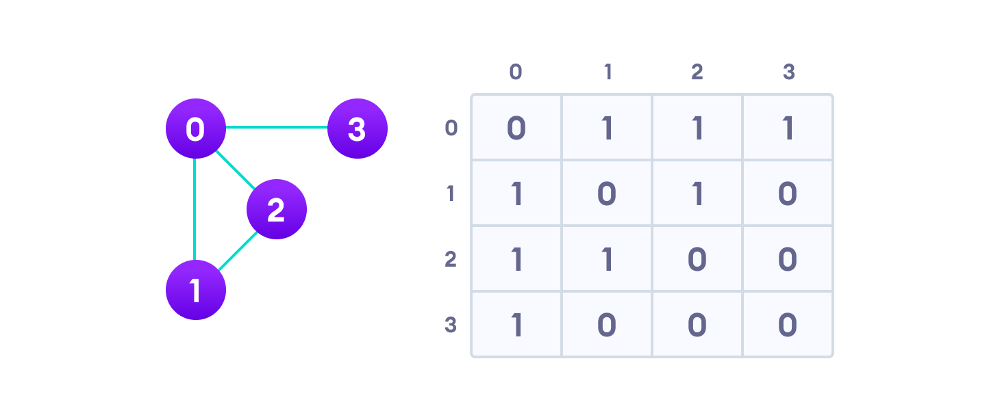

Since it is an undirected graph, for edge (0,2), we also need to mark edge (2,0); making the adjacency matrix symmetric about the diagonal.

Edge lookup(checking if an edge exists between vertex A and vertex B) is extremely fast in adjacency matrix representation but we have to reserve space for every possible link between all vertices(V x V), so it requires more space.

### 2. Adjacency List

An adjacency list represents a graph as an array of linked lists.

The index of the array represents a vertex and each element in its linked list represents the other vertices that form an edge with the vertex.

The adjacency list for the graph we made in the first example is as follows:


An adjacency list is efficient in terms of storage because we only need to store the values for the edges. For a graph with millions of vertices, this can mean a lot of saved space.

</br>

## Graph Operations

The most common graph operations are:

- Check if the element is present in the graph.
- Graph Traversal.
- Add elements(vertex, edges) to graph.
- Finding the path from one vertex to another.

</br>

## Minimum Spanning Tree

A **Minimum Spanning Tree (MST)** is a subset of edges of a connected weighted undirected graph that connects all the vertices together with the minimum possible total edge weight. To derive an MST, Prim’s algorithm or Kruskal’s algorithm can be used. Hence, we will discuss Prim’s algorithm in this chapter.

As we have discussed, one graph may have more than one spanning tree. If there are n number of vertices, the spanning tree should have `𝒏−𝟏` number of edges. In this context, if each edge of the graph is associated with a weight and there exists more than one spanning tree, we need to find the minimum spanning tree of the graph.

Moreover, if there exist any duplicate weighted edges, the graph may have multiple minimum spanning tree.

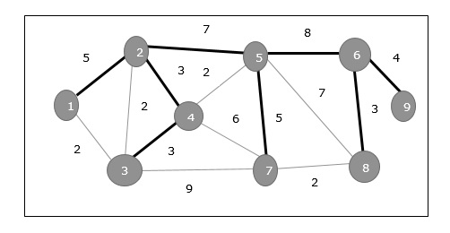

In the above graph, we have shown a spanning tree though it’s not the minimum spanning tree. The cost of this spanning tree is

$$
(5+7+3+3+5+8+3+4)=38
$$

### Types of Graphs

#### Null Graph

The Null Graph is also known as the order zero graph. The term "**_null graph_**" refers to a graph with an empty edge set. In other words, a null graph has no edges, and the null graph is present with only isolated vertices in the graph.

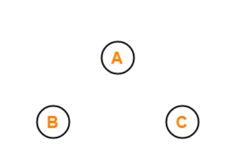

The image displayed above is a null or zero graphs because it has zero edges between the three vertices of the graph.

#### Trivial Graph

A graph is called a trivial graph if it has only one vertex present in it. The trivial graph is the smallest possible graph that can be created with the least number of vertices that is one vertex only.


The above is an example of a trivial graph having only a single vertex in the whole graph named vertices A.

#### Non-Directed Graph

A graph is called a non-directed graph if all the edges present between any graph nodes are non-directed. By non-directed edges, we mean the edges of the graph that cannot be determined from the node it is starting and at which node it is ending. All the edges for a graph need to be non-directed to call it a non-directed graph. All the edges of a non-directed graph don't have any direction.


The graph that is displayed above is an example of a disconnected graph. This graph is called a disconnected graph because there are four vertices named vertex A, vertex B, vertex C, and vertex D. There are also exactly four edges between these vertices of the graph. And all the vertices that are present between the different nodes of the graph are not directed, which means the edges don't have any specific direction.

For example, the edge between vertex A and vertex B doesn't have any direction, so we cannot determine whether the edge between vertex A and vertex B starts from vertex A or vertex B. Similarly, we can't determine the ending vertex of this edge between these nodes.

#### Directed Graph

Another name for the directed graphs is digraphs. A graph is called a directed graph or digraph if all the edges present between any vertices or nodes of the graph are directed or have a defined direction. By directed edges, we mean the edges of the graph that have a direction to determine from which node it is starting and at which node it is ending.


All the edges for a graph need to be directed to call it a directed graph or digraph. All the edges of a directed graph or digraph have a direction that will start from one vertex and end at another.

The graph that is displayed above is an example of a connected graph. This graph is called a connected graph because there are four vertices in the graph named vertex A, vertex B, vertex C, and vertex D. There are also exactly four edges between these vertices of the graph and all the vertices that are present between the different nodes of the graph are directed (or pointing to some of the vertices) which means the edges have a specific direction assigned to them.

For example, consider the edge that is present between vertex D and vertex A. This edge shows that an arrowhead is pointing towards vertex A, which means this edge starts from vertex D and ends at vertex A.

#### Connected Graph

For a graph to be labelled as a connected graph, there must be at least a single path between every pair of the graph's vertices. In other words, we can say that if we start from one vertex, we should be able to move to any of the vertices that are present in that particular graph, which means there exists at least one path between all the vertices of the graph.


The graph shown above is an example of a connected graph because we start from any one of the vertices of the graph and start moving towards any other remaining vertices of the graph. There will exist at least one path for traversing the graph.

For example, if we begin from vertex B and traverse to vertex H, there are various paths for traversing. One of the paths is

Vertice B -> vertice C -> vertice D -> vertice F -> vertice E -> vertice H.

Similarly, there are other paths for traversing the graph from vertex B to vertex H. there is at least one path between all the graph nodes. In other words, we can say that all the vertices or nodes of the graph are connected to each other via edge or number of edges.

#### Disconnected Graph

A graph is said to be a disconnected graph where there does not exist any path between at least one pair of vertices. In other words, we can say that if we start from any one of the vertices of the graph and try to move to the remaining present vertices of the graph and there exists not even a single path to move to that vertex, then it is the case of the disconnected graph. If any one of such a pair of vertices doesn't have a path between them, it is called a **_disconnected graph_**.


The graph shown above is a disconnected graph. The above graph is called a disconnected graph because at least one pair of vertices doesn't have a path to traverse starting from either node.

For example, a single path between both vertices doesn't exist if we want to traverse from vertex A to vertex G. In other words, we can say that all the vertices or nodes of the graph are not connected to each other via edge or number of edges so that they can be traversed.

#### Regular Graph

For a graph to be called a regular, it should satisfy one primary condition: all graph vertices should have the same degree. By the degree of vertices, we mean the number of nodes associated with a particular vertex. If all the graph nodes have the same degree value, then the graph is called a **_regular graph_**. If all the vertices of a graph have the degree value of 6, then the graph is called a 6-regular graph. If all the vertices in a graph are of degree 'k', then it is called a "**_k-regular graph_**".


The graphs that are displayed above are regular graphs. In graph 1, there are three vertices named vertex A, vertex B, and vertex C, All the vertices in graph 1, have the degree of each node as 2. The degree of each vertex is calculated by counting the number of edges connected to that particular vertex.

For vertex A in graph 1, there are two edges associated with vertex A, one from vertex B and another from vertex D. Thus, the degree of vertex A of graph one is 2. Similarly, for other vertices of the graph, there are only two edges associated with each vertex, vertex B and vertex D. Therefore, vertex B and vertex D are 2. As the degree of all the three nodes of the graph is the same, that is 2. Therefore, this graph is called a 2-regular graph.

Similarly, for the second graph shown above, there are four vertices named vertex E, vertex F, vertex G, and vertex F. The degree of all the four vertices of this graph is 2. Each vertex of the graph is 2 because only two edges are associated with all of the graph's vertices. As all the nodes of this graph have the same degree of 2, this graph is called a **_regular graph_**.

#### Complete Graph

A graph is said to be a complete graph if, for all the vertices of the graph, there exists an edge between every pair of the vertices. In other words, we can say that all the vertices are connected to the rest of all the vertices of the graph. A complete graph of 'n' vertices contains exactly nC2 edges, and a complete graph of 'n' vertices is represented as Kn.


There are two graphs name K3 and K4 shown in the above image, and both graphs are complete graphs. Graph K3 has three vertices, and each vertex has at least one edge with the rest of the vertices. Similarly, for graph K4, there are four nodes named vertex E, vertex F, vertex G, and vertex H. For example, the vertex F has three edges connected to it to connect it to the respective three remaining vertices of the graph. Likewise, for the other three reaming vertices, there are three edges associated with each one of them. As all the vertices of this graph have a separate edge for other vertices, it is called a **_complete graph_**.

#### Cycle Graph

If a graph with many vertices greater than three and edges form a cycle, then the graph is called a **_cycle graph_**. In a graph of cycle type, the degree of all the vertices of the cycle graph will be 2.


There are three graphs shown in the above image, and all of them are examples of the cyclic graph because the number of nodes for all of these graphs is greater than two and the degree of all the vertices of all these graphs is exactly 2.

#### Cyclic Graph

For a graph to be called a cyclic graph, it should consist of at least one cycle. If a graph has a minimum of one cycle present, it is called a cyclic graph.


The graph shown in the image has two cycles present, satisfying the required condition for a graph to be cyclic, thus making it a cyclic graph.

#### Acyclic Graph

A graph is called an acyclic graph if zero cycles are present, and an acyclic graph is the complete opposite of a cyclic graph.

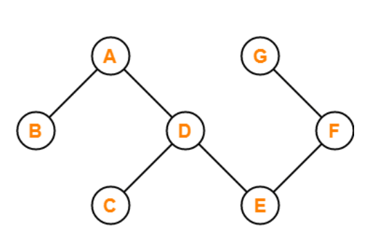

The graph shown in the above image is acyclic because it has zero cycles present in it. That means if we begin traversing the graph from vertex B, then a single path doesn't exist that will traverse all the vertices and end at the same vertex that is vertex B.

#### Finite Graph

If the number of vertices and the number of edges that are present in a graph are finite in number, then that graph is called a finite graph.

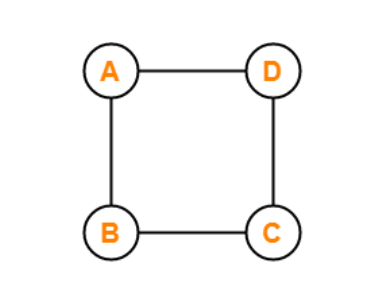

The graph shown in the above image is the finite graph. There are four vertices named vertex A, vertex B, vertex C, and vertex D, and the number of edges present in this graph is also four, as both the number of nodes and vertices of this graph is finite in number it is called a finite graph.

#### Infinite Graph

If the number of vertices in the graph and the number of edges in the graph are infinite in number, that means the vertices and the edges of the graph cannot be counted, then that graph is called an infinite graph.


As we can see in the above image, the number of vertices in the graph and the number of edges in the graph are infinite, so this graph is called an infinite graph.

#### Bipartite Graph

For a graph to be a Bipartite graph, it needs to satisfy some of the basic preconditions. These conditions are:

- All the vertices of the graph should be divided into two distinct sets of vertices X and Y.
- All the vertices present in the set X should only be connected to the vertices present in the set Y with some edges. That means the vertices present in a set should not be connected to the vertex that is present in the same set.
- Both the sets that are created should be distinct that means both should not have the same vertices in them.

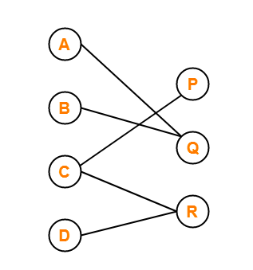

The graph shown in the above image is divided into two vertices named set X and set Y. The contents of these sets are,

`Set X = {vertex A, vertex B, vertex C, vertex D}
Set Y = {vertex P, vertex Q, vertex R}`

The vertex A of the set X is associated with the vertex Q of the set Y. And the vertex B is also connected to the vertex Q. The vertex C of the set X is connected to the two vertices of the set Y named vertex P and vertex R. The vertex D of the set X is associated with the vertex Q of the set R.

Similarly, all the vertices present in the set Y are only connected to the vertices from the set X. And both set X and set Y have non-repeating or distinct elements present in them. The graph shown in the above image satisfies all the conditions for the Bipartite graph, and thus it is a Bipartite graph.

#### Planar Graph

A graph is called a planar graph if that graph can be drawn in a single plane with any two of the edges intersecting each other.

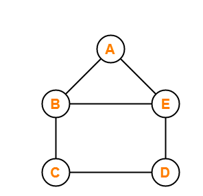

The graph shown in the above image can be drawn in a single plane with any two edges intersecting. Thus it is a planar graph.

#### Simple Graph

A graph is said to be a simple graph if the graph doesn't consist of no self-loops and no parallel edges in the graph.

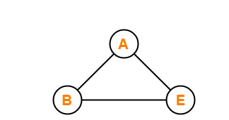

We have three vertices and three edges for the graph that is shown in the above image. This graph has no self-loops and no parallel edges; therefore, it is called a simple graph.

#### Multi Graph

A graph is said to be a multigraph if the graph doesn't consist of any self-loops, but parallel edges are present in the graph. If there is more than one edge present between two vertices, then that pair of vertices is said to be having parallel edges.

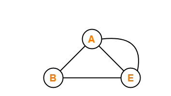

We have three vertices and three edges for the graph that is shown in the above image. There are no self-loops, but two edges connect these two vertices between vertex A and vertex E of the graph. In other words, we can say that if two vertices of a graph are connected with more than one edge in a graph, then it is said to be having parallel edges, thus making it a multigraph.

#### Pseudo Graph

If a graph consists of no parallel edges, but self-loops are present in a graph, it is called a pseudo graph. The meaning of a self-loop is that there is an edge present in the graph that starts from one of the graph's vertices, and if that edge ends on the same vertex, then it is called a pseudo graph.

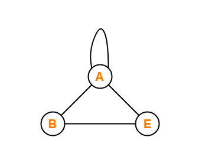

The graph shown in the above image has vertex A, vertex B and vertex E. There are four edges in this graph, and there are three edges associated with vertex A, and among these three edges, one of the edges is a self-loop. And among these four edges present in there is no parallel edge in it. Since the graph shown above has a self-loop and no parallel edge present in it, thus it is a pseudo graph.

#### Euler Graph

If all the vertices present in a graph have an even degree, then the graph is known as an Euler graph. By degree of a vertex, we mean the number of edges that are associated with a vertex. So for a graph to be an Euler graph, it is required that all the vertices in the graph should be associated with an even number of edges.

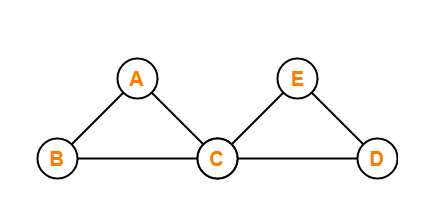

In the graph shown in the above image, we have five vertices named vertex A, vertex B, vertex C, vertex D and vertex E. All the vertices except vertex C have a degree of 2, which means they are associated with two edges each of the vertex. At the same time, vertex C is associated with four edges, thus making it degree 4. The degree of vertex C and other vertices is 4 and 2, respectively, which are even. Therefore, the graph displayed above is an Euler graph.

#### Hamilton Graph

Suppose a closed walk in the connected graph that visits every vertex of the graph exactly once (except starting vertex) without repeating the edges. Such a graph is called a **_Hamiltonian graph_**, and such a walk is called a **_Hamiltonian path_**. The Hamiltonian circuit is also known as Hamiltonian Cycle.

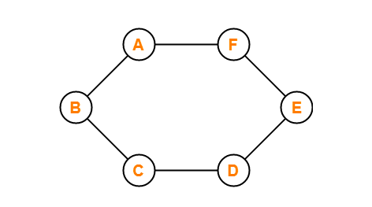

In other words, A Hamiltonian path that starts and ends at the same vertex is called a Hamiltonian circuit. Every graph that contains a Hamiltonian circuit also contains a Hamiltonian path, but vice versa is not true. There may exist more than one Hamiltonian path and Hamiltonian circuit in a graph.

The graph shown in the above image consists of a closed path ABCDEFA which starts from vertex A and traverses all other vertices or nodes without traversing any of the nodes twice other than vertex A in the path of traversal. Therefore, the graph shown in the above image is a Hamilton graph.
