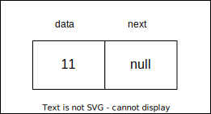

# Linked List

It's a collection of nodes where each node contains data as well as the memory address of the next node in the list.

| prepend() | append() | lookup() | insert() | delete() |
| --------- | -------- | -------- | -------- | -------- |
| O(1)      | O(1)     | O(n)     | O(n)     | O(n)     |

## Nodes in a Linked List

Nodes are the building block of the linked list.



A node in a linked list consists of two parts:

- `data` which denotes the value of the node.
- `next` which is a reference to the succeeding node.

## Head and Tail in a Linked List

- The first node of the linked list is called the `head` node. It is the starting point of a linked list.

- The last node is called the `tail` node. As there is no node after the last node, the last node always points to the null.

- A `null` pointer does not point to any memory location.

## Types of Linked List

- Singly Linked Lists
- Doubly Linked Lists
- Circular Linked Lists

### Singly Linked Lists

Traversals can be done in one direction only.


### Doubly Linked Lists

It's a bidirectional linked list.


### Circular Linked Lists

Traversal in this linked list will go on forever until it is broken.


#### Basic Operations in the Linked Lists

- **Insertion** − Adds an element at the beginning of the list.

- **Deletion** − Deletes an element at the beginning of the list.

- **Display** − Displays the complete list.

- **Search** − Searches an element using the given key.

- **Delete** − Deletes an element using the given key.

##### Insertion Operation

- Insertion at Beginning

  ```text
  1. START
  2. Create a node to store the data
  3. Check if the list is empty
  4. If the list is empty, add the data to the node and assign the head pointer to it.
  5. If the list is not empty, add the data to a node and link to the current head. Assign the head to the newly added node.
  6. END
  ```

- Insertion at Ending

  ```text
  1. START
  2. Create a new node and assign the data
  3. Find the last node
  4. Point the last node to new node
  5. END
  ```

- Insertion at a Given Position

  ```text
  1. START
  2. Create a new node and assign data to it
  3. Iterate until the node at position is found
  4. Point first to new first node
  5. END
  ```

##### Deletion Operation

- Deletion at Beginning

  ```text
  1. START
  2. Assign the head pointer to the next node in the list
  3. END
  ```

- Deletion at Ending

  ```text
  1. START
  2. Iterate until you find the second last element in the list.
  3. Assign NULL to the second last element in the list.
  4. END
  ```

- Deletion at a Given Position

  ```text
  1. START
  2. Iterate until find the current node at position in the list
  3. Assign the adjacent node of current node in the list to its previous node.
  4. END
  ```

##### Reverse Operation

```text
1. START
2. We use three pointers to perform the reversing: prev, next, head.
3. Point the current node to head and assign its next value to the prev node.
4. Iteratively repeat the step 3 for all the nodes in the list.
5. Assign head to the prev node.
```

##### Search Operation

```text
1. START
2. If the list is not empty, iteratively check if the list contains the key
3. If the key element is not present in the list, unsuccessful search
4. END
```

##### Traversal Operation

```text
1. START
2. While the list is not empty and did not reach the end of the list, print the data in each node
3. END
```
