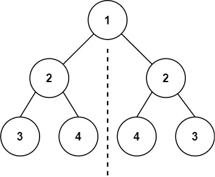

# 101. Symmetric Tree

Given the `root` of a binary tree, check whether it is a mirror of itself (i.e., symmetric around its center).

## Example 1



```text
Input: root = [1,2,2,3,4,4,3]
Output: true
```

## Example 2


```text
Input: root = [1,2,2,null,3,null,3]
Output: false
```

## Constraints

- The number of nodes in the tree is in the range `[1, 1000]`.
- `-100 <= Node.val <= 100`

## Solution

```c++
/**
 * Definition for a binary tree node.
 * struct TreeNode {
 *     int val;
 *     TreeNode *left;
 *     TreeNode *right;
 *     TreeNode() : val(0), left(nullptr), right(nullptr) {}
 *     TreeNode(int x) : val(x), left(nullptr), right(nullptr) {}
 *     TreeNode(int x, TreeNode *left, TreeNode *right) : val(x), left(left), right(right) {}
 * };
 */
class Solution {
public:
    bool isSymmetric(TreeNode* root) {

        if(root == nullptr)
        {
            return true;
        }

        return isSymmetricHelper(root->left, root->right);
    }

    bool isSymmetricHelper(TreeNode* leftNode, TreeNode* rightNode) {
    if (leftNode == nullptr && rightNode == nullptr) {
        return true;
    }

    if (leftNode == nullptr || rightNode == nullptr || leftNode->val != rightNode->val) {
        return false;
    }

    return isSymmetricHelper(leftNode->left, rightNode->right) && isSymmetricHelper(leftNode->right, rightNode->left);
}
};
```
