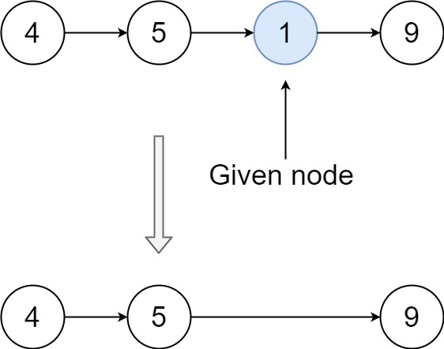

# 237. Delete Node in a Linked List

There is a singly-linked list `head` and we want to delete a `node` node in it.

You are given the node to be deleted `node`. You will not be given access to the first node of `head`.

All the values of the linked list are unique, and it is guaranteed that the given node `node` is not the last node in the linked list.

Delete the given node. Note that by deleting the node, we do not mean removing it from memory. We mean:

- The value of the given node should not exist in the linked list.
- The number of nodes in the linked list should decrease by one.
- All the values before node should be in the same order.
- All the values after node should be in the same order.

## Example 1


```text
Input: head = [4,5,1,9], node = 5
Output: [4,1,9]
Explanation: You are given the second node with value 5, the linked list should become 4 -> 1 -> 9 after calling your function.
```

## Example 2



```text
Input: head = [4,5,1,9], node = 1
Output: [4,5,9]
Explanation: You are given the third node with value 1, the linked list should become 4 -> 5 -> 9 after calling your function.
```

## Constraints

- `n == nums.length`
- `1 <= n <= 5 * 10^4`
- `-10^9 <= nums[i] <= 10^9`

## Solution

### C++

```c++
/**
 * Definition for singly-linked list.
 * struct ListNode {
 *     int val;
 *     ListNode *next;
 *     ListNode(int x) : val(x), next(NULL) {}
 * };
 */
class Solution {
public:
    void deleteNode(ListNode* node) {
        ListNode* nextNode = node->next;
        node->val = nextNode->val;
        node->next = nextNode->next;
        delete nextNode;
    }
};
```

### Python

```python
# Definition for singly-linked list.
# class ListNode:
#     def __init__(self, x):
#         self.val = x
#         self.next = None

class Solution:
    def deleteNode(self, node):
        """
        :type node: ListNode
        :rtype: void Do not return anything, modify node in-place instead.
        """
        node.val = node.next.val
        node.next = node.next.next
```
