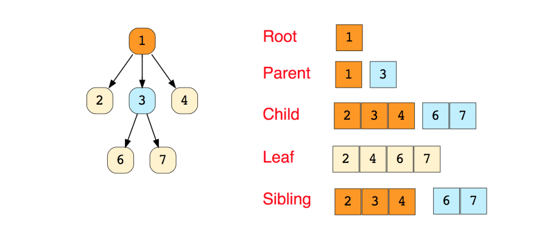
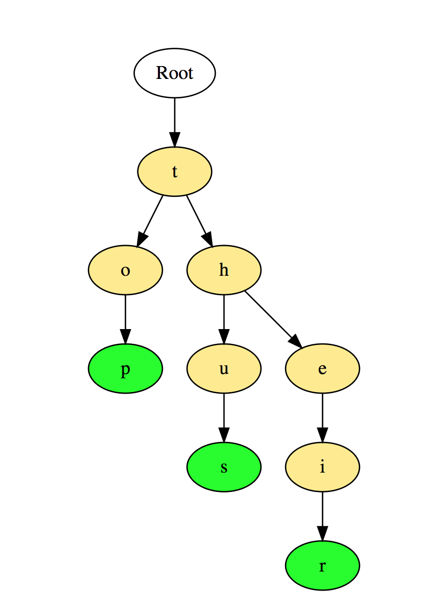

# Tree

A tree is a hierarchical data structure consisting of vertices (nodes) and edges that connect them. Trees are similar to graphs, but the key point that differentiates a tree from the graph is that a cycle cannot exist in a tree.

Trees are extensively used in Artificial Intelligence and complex algorithms to provide an efficient storage mechanism for problem-solving.

Here's an image of a simple tree, and basic terminologies used in tree data structure:

## The following are the types of trees

- N-ary Tree
- Balanced Tree
- Binary Tree
- Binary Search Tree
- AVL Tree
- Red Black Tree
- 2–3 Tree

Out of the above, Binary Tree and Binary Search Tree are the most commonly used trees.

## Trie

Trie which is also known as `Prefix Trees`, is a tree-like data structure which proves to be quite efficient for solving problems related to strings. It provides fast retrieval, and mostly used for searching words in a dictionary, providing auto suggestions in a search engine, and even for IP routing.

Here's an illustration of how three words `top`, `thus` and `their` are stored in Trie:

The words are stored in the top to the bottom manner where green colored nodes `p`, `s` and `r` indicates the end of `top`, `thus` and `their` respectively.

### Binary Search Tree

Number of nodes = 2^h^ - 1

| lookup() | insert() | delete() |
| -------- | -------- | -------- |
| O(log N) | O(log N) | O(log N) |

### Advantages of Binary Search Tree

- Balanced BST allows quick insertion and deletion with a time complexity of O(log n).
- BST enables quick searching with most operations having a time complexity of O(log n).
- BST keeps items in a sorted sequence automatically.

### Disadvantages of Binary Search Tree

- The key drawback is that a balanced binary search tree needs to be implemented at all times.
- Since the time complexity for search, insert, and delete operations is O(log n), which is good for big data sets but slower than some other data structures like arrays or hash tables, they are not well-suited for data structures that need to be accessed randomly.

## Binary Heap

A Binary Heap is a complete Binary Tree which is used to store data efficiently to get the max or min element based on its structure.

### How is Binary Heap represented?

A Binary Heap is a Complete Binary Tree. A binary heap is typically represented as an array.

- The root element will be at Arr[0].
- The below table shows indices of other nodes for the ith node, i.e., Arr[i]:

|     Arr[ (i-1)/2 ]      |       Arr[ (2* i)+1 ]       |        Arr[ (2*i)+2 ]        |
| :---------------------: | :-------------------------: | :--------------------------: |
| Returns the parent node | Returns the left child node | Returns the right child node |

#### Time complexity of Binary Heap

| lookup |  insert  |  delete  |
| :----: | :------: | :------: |
|  O(n)  | O(log N) | O(log N) |

##### Advantages of Binary Heap

- Better than O(n)
- Priority
- Flexible Size
- Fast Insert

##### Disadvantages of Binary Heap

- Slow Lookup
